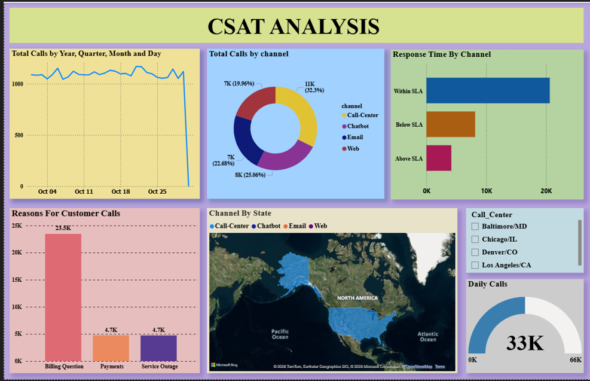
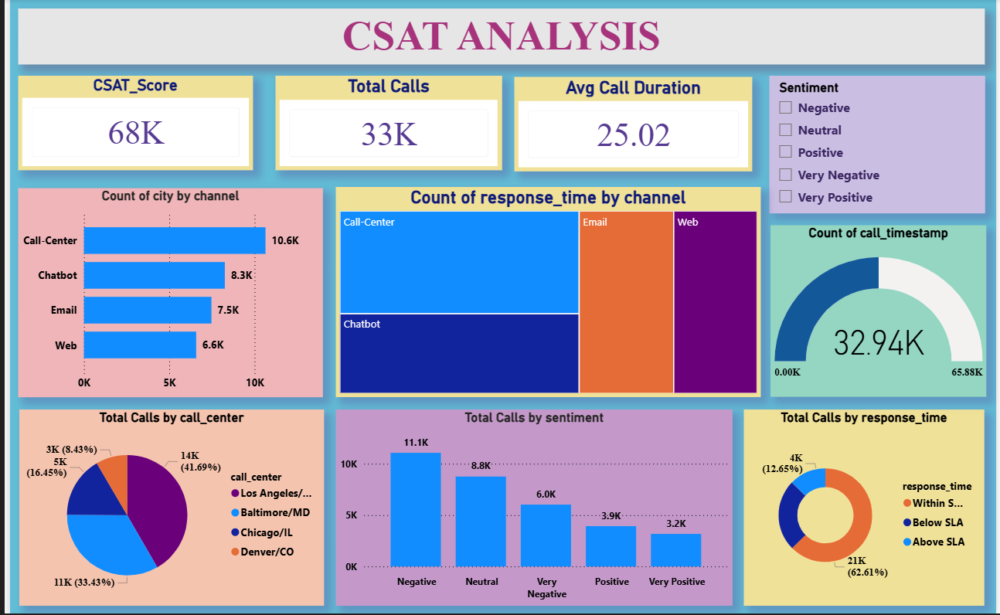

# 📊 CSAT Analytics Project

## Overview

The CSAT (Customer Satisfaction) Analytics Project is a Power BI dashboard designed to analyze customer satisfaction data and transform customer feedback into actionable business insights. The dashboard provides an interactive and data-driven approach to monitoring customer satisfaction performance, identifying trends, and supporting strategic decision-making.

By leveraging Power BI's visualization and analytical capabilities, this project enables organizations to better understand customer experiences and identify opportunities for improvement.

---

## Business Problem

Customer satisfaction is a critical metric for measuring business success. Organizations collect large amounts of customer feedback, but extracting meaningful insights from this data can be challenging.

This project helps address that challenge by:

- Tracking customer satisfaction performance.
- Identifying satisfaction trends over time.
- Highlighting areas that require improvement.
- Supporting data-driven business decisions.
- Improving customer experience management.

---

## Project Objectives

- Analyze customer satisfaction (CSAT) metrics.
- Monitor customer feedback trends.
- Identify strengths and weaknesses in customer experience.
- Provide interactive visualizations for stakeholders.
- Generate actionable insights from customer data.

---

## Tools & Technologies Used

- **Power BI Desktop**
- **Power Query**
- **DAX (Data Analysis Expressions)**
- **Data Modeling**
- **Microsoft PowerPoint**
- **Data Visualization Techniques**

---

## Dashboard Features

### Executive Overview
- Overall Customer Satisfaction Score
- Key Performance Indicators (KPIs)
- Satisfaction Summary Metrics

### Customer Satisfaction Analysis
- Satisfaction Distribution
- Performance Comparison
- Category-wise Analysis

### Trend Analysis
- Customer Satisfaction Trends
- Time-Based Performance Monitoring
- Pattern Identification

### Interactive Dashboard
- Dynamic Filters
- Slicers
- Drill-Down Analysis
- Interactive Visualizations

---

## Dashboard Preview

### Dashboard Overview

### Dashboard Insights

---

## Project Files

| File Name | Description |
|------------|------------|
| csat project.pbix | Power BI dashboard file |
| CSAT Analysis Project.pptx | Project presentation |
| dashboard-overview.png.png | Dashboard overview screenshot |
| dashboard-insights.png.png | Dashboard insights screenshot |
| README.md | Project documentation |

---

## Workflow

### 1. Data Collection
Customer feedback and satisfaction data were gathered from the source dataset.

### 2. Data Cleaning
Power Query was used to clean, transform, and prepare the data for analysis.

### 3. Data Modeling
Relationships were created to build an efficient and scalable data model.

### 4. DAX Calculations
Custom measures and KPIs were developed using DAX.

### 5. Dashboard Development
Interactive visualizations and reports were created using Power BI.

### 6. Insight Generation
Business insights were derived from the analysis to support decision-making.

---

## Key Insights

The dashboard helps answer important business questions such as:

- What is the overall customer satisfaction score?
- How has customer satisfaction changed over time?
- Which categories perform best and worst?
- What trends indicate potential customer concerns?
- Which areas require immediate improvement?

---

## Business Impact

This project demonstrates how business intelligence solutions can:

- Improve customer experience.
- Increase customer retention.
- Enhance service quality monitoring.
- Support strategic planning.
- Enable data-driven decision-making.

---

## Skills Demonstrated

- Data Cleaning & Transformation
- Data Modeling
- DAX Calculations
- Business Intelligence Reporting
- Dashboard Design
- Data Visualization
- Analytical Thinking
- Insight Generation

---

## Future Enhancements

- Predictive Customer Satisfaction Analysis
- Customer Churn Prediction
- Real-Time Dashboard Integration
- Sentiment Analysis
- AI-Powered Customer Insights

---

Aspiring Data Analyst | Power BI Developer

GitHub: https://github.com/nikhilkumarreddy84

---

## Conclusion

The CSAT Analytics Project showcases the power of data analytics and visualization in transforming customer feedback into actionable business insights. Through interactive dashboards and meaningful KPIs, organizations can better understand customer needs, improve satisfaction levels, and drive continuous improvement.

⭐ If you found this project useful, consider giving the repository a star.
